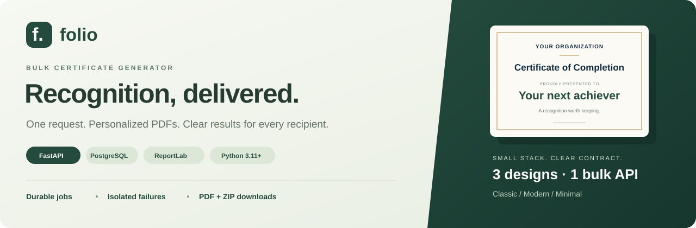
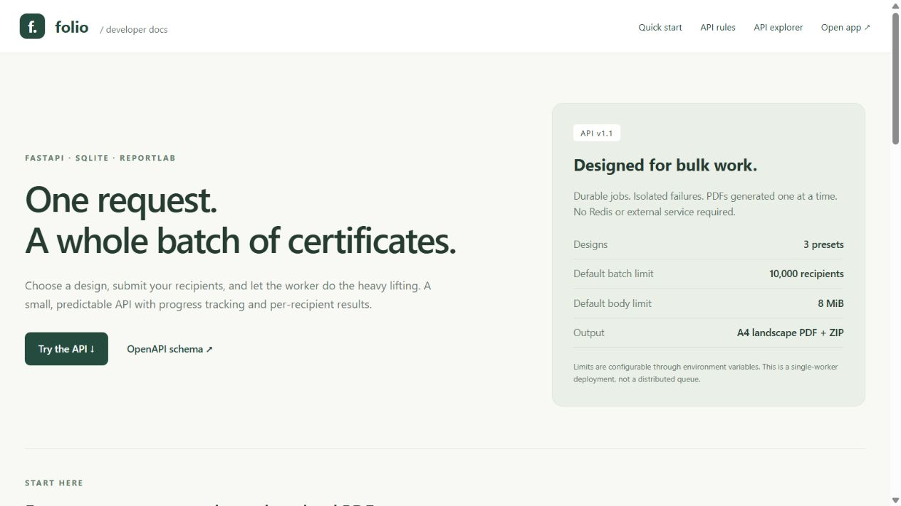

<p align="center">
  
</p>

<h1 align="center">Folio · Bulk Certificate Generator</h1>

<p align="center">
  <a href="https://aereo-assignment-certificate-genera.vercel.app/"><strong>Live application</strong></a> ·
  <a href="https://aereo-assignment-certificate-genera.vercel.app/docs">Live API documentation</a> ·
  <a href="docs/SUBMISSION.md">Project submission</a>
</p>

<p align="center">
  A lightweight certificate workflow for training teams, event organizers, and learning platforms.<br />
  <strong>Submit a batch. Track every recipient. Deliver personalized PDF certificates.</strong>
</p>

<p align="center">
  <a href="#quick-start">Quick start</a> ·
  <a href="#product-preview">Product preview</a> ·
  <a href="#submit-a-generation-request">API guide</a> ·
  <a href="#learn-the-backend">Learn the backend</a> ·
  <a href="#architecture-and-processing-flow">Architecture</a> ·
  <a href="#testing-and-quality-checks">Testing</a> ·
  <a href="#learning-and-future-scope">Roadmap</a>
</p>

---

## Overview

### Deploy the complete application for free

Use **Vercel** for the frontend, **Render Free** for FastAPI and the embedded
worker, and **Neon Free PostgreSQL** for persistent jobs and PDFs. See the
[deployment guide](docs/DEPLOYMENT.md) for configuration and submission checks.
Local SQLite and the separate worker still work as before.

Generating certificates should not require a request per participant or hide individual failures
inside an opaque batch. Folio provides a **backend-first, asynchronous workflow**: the API accepts
shared certificate information and recipients, persists a durable job, and returns an ID immediately.
A separate worker generates PDFs one recipient at a time while clients track progress and results.

The browser workspace is a convenient client for the same API—not a separate generation system.
Python and SQLite are sufficient to run locally, without a paid database, Redis, or a browser-based
PDF generation service.

### What the application delivers

- **Bulk generation:** one JSON request for many recipients; configurable defaults of 10,000
  recipients and 8 MiB per request.
- **Three designs:** Classic, Modern, and Minimal, with personalized fields in landscape A4 vector PDFs.
- **Visible outcomes:** batch progress, paginated results, and an error for each unsuccessful row.
- **Failure isolation:** an invalid recipient or individual rendering error does not stop valid rows.
- **Durable processing:** SQLite-backed jobs, restart recovery, atomic output, and idempotent retries.
- **Practical delivery:** actual PDF previews, individual downloads, and a ZIP of successful PDFs.
- **Clear integration:** typed endpoints, OpenAPI, and an interactive guide with ready-to-edit examples.

> **Deployment scope:** designed for one machine and one PDF worker. This is not a distributed
> queue, a multi-tenant SaaS platform, or a claim of unlimited certificate capacity.

## Learn the backend

Choose the documentation that fits your goal:

- [Technical guide](docs/TECHNICAL_GUIDE.md): every direct library, standard-library tools,
  browser/development dependencies, database structure, request-to-PDF flow, and interview explanations.
- [Detailed API reference](docs/API_REFERENCE.md): every public endpoint, headers, all input/output
  fields, pagination, status meanings, complete request/response examples, error bodies, and a
  copy-ready PowerShell workflow that polls before downloading.
- [Interactive documentation](http://127.0.0.1:8000/docs): run actual requests after starting locally.

The main responsibilities are deliberately separated: **FastAPI/Uvicorn** handle HTTP,
**Pydantic/email-validator** validate inputs, **SQLite** persists jobs, **filelock** coordinates
the worker/archive builder, and **ReportLab** creates PDFs. **PDF.js** only previews finished PDFs;
**Swagger UI** provides API exploration. **pytest, HTTPX, pypdf, Ruff, and Prettier** support
verification and development. No React build, Celery, Redis, or paid PDF service is required.

## Product preview

### Three designs, one consistent API

<p align="center">
  
  
  
</p>

<p align="center"><strong>Classic</strong> · Formal &amp; timeless &nbsp; | &nbsp; <strong>Modern</strong> · Bold &amp; contemporary &nbsp; | &nbsp; <strong>Minimal</strong> · Clean &amp; understated</p>

These images preview actual PDFs generated by the backend. Each batch selects one design; the
organization, title, recipient, course, date, signatory, role, and reference remain dynamic.
All presets share the same validation, text-fitting logic, and processing pipeline.

**Classic remains the default**, preserving the original assignment's single-template behavior
and older jobs. Modern and Minimal are optional presets. There is no template editor or arbitrary
uploaded code: layouts live in `app/renderer.py`, with the public catalogue in `app/templates.py`.

## Quick start

Python 3.11 or newer. SQLite is a relational database included with Python: no database account,
paid service, Docker, Redis, or additional server is required. Use a local disk for `data/`.

<details open>
<summary><strong>Windows · PowerShell</strong></summary>

From the project directory:

```powershell
python -m venv .venv
.\.venv\Scripts\python.exe -m pip install -e ".[dev]" -c requirements.lock
.\.venv\Scripts\python.exe -m uvicorn app.main:app --host 127.0.0.1 --port 8000
```

Open a **second terminal in the same directory** and start the worker:

```powershell
.\.venv\Scripts\python.exe -m app.worker
```

</details>

<details>
<summary><strong>Linux / macOS</strong></summary>

```bash
python3 -m venv .venv
source .venv/bin/activate
python -m pip install -e '.[dev]' -c requirements.lock
python -m uvicorn app.main:app --host 127.0.0.1 --port 8000
# In a second terminal, activate the same virtual environment:
python -m app.worker
```

</details>

Open [the Folio workspace](http://127.0.0.1:8000/) to create and view certificates.
[API guide and interactive explorer](http://127.0.0.1:8000/docs), [ReDoc](http://127.0.0.1:8000/redoc), and
`/openapi.json` are also available for API testing.

> **Start both processes.** The API accepts jobs without the worker, but valid recipients remain
> queued until it starts. Both processes must use the same data directory and environment settings.

If port 8000 is occupied, check whether Folio is already running before starting another server.

For development, add `--reload` to Uvicorn. For a one-time drain of queued jobs:

```powershell
.\.venv\Scripts\python.exe -m app.worker --once
```

## Submit a generation request

### Using the frontend

1. Open `http://127.0.0.1:8000/`, choose a **Certificate design**, and enter the shared details.
2. Add recipients manually or choose **Import a list** to paste or upload CSV.
3. Click **Generate certificates**. The results screen tracks progress automatically.
4. Click **Preview** to view an actual generated PDF, **PDF** to download one, or
   **Download batch ZIP** to download all successful certificates after processing finishes.
5. Open **Batch history** to revisit earlier jobs. Use **Need attention** to see validation and
   generation errors, or switch between grid and list layouts.

**Try an example** fills a valid three-person batch. The date defaults to the browser's local
calendar date. The live HTML preview shows the layout; the generated PDF viewer shows the actual
file with embedded fonts, rendered on demand using [Mozilla PDF.js](https://mozilla.github.io/pdf.js/).
No external CDN, browser PDF plugin, or frontend development server is required.

CSV accepts a `name` column and optional `email` and `reference` columns, in any order:

```csv
name,email,reference
Rithi Aluri,rithi@example.com,STUDENT-001
"Sharma, Aarav",aarav@example.com,STUDENT-002
Meera Rao,,STUDENT-003
```

An example file is included at `examples/recipients.csv`.

Headerless CSV uses that same column order. Quoted commas, escaped quotes, Windows line endings,
and UTF-8 BOMs are supported. Blank rows are skipped; partial rows are submitted for individual
validation. Import is converted to the existing bounded JSON API; it does not bypass batch/body
limits or stream unlimited CSV on the server. Manual entry supports up to 100 visible rows;
CSV import supports the configured batch limit. Recipient results load 12 at a time.

If authentication is enabled, enter the key in **Connection settings**. The key is kept in tab
session storage, and the server issues a separate HttpOnly, SameSite=Strict browser-session cookie
for native file downloads. The cookie contains an HMAC credential, not the API key, and becomes
invalid when the server key changes. This allows ZIPs to stream through browser downloads instead
of buffering a whole archive in JavaScript. API clients can still use `X-API-Key` as before.

### Using the API

PowerShell:

```powershell
$job = Invoke-RestMethod -Method Post -Uri http://127.0.0.1:8000/api/jobs `
  -ContentType 'application/json' -Body (Get-Content examples/job.json -Raw) `
  -Headers @{ 'Idempotency-Key' = 'aereo-demo-001' }
$job
```

curl (on Windows use `curl.exe`):

```bash
curl -X POST http://127.0.0.1:8000/api/jobs \
  -H 'Content-Type: application/json' \
  -H 'Idempotency-Key: aereo-demo-001' \
  --data-binary @examples/job.json
```

Request:

```json
{
  "certificate": {
    "template": "modern",
    "organization": "Aereo Learning Academy",
    "course": "Python Backend Development",
    "issued_on": "2026-10-08",
    "signatory": "Dr. Vidya Pawar",
    "signatory_role": "Program Director"
  },
  "recipients": [
    {
      "name": "Rithi Aluri",
      "email": "rithi@example.com",
      "reference": "STUDENT-001"
    },
    { "name": "Aarav Sharma", "email": "aarav@example.com" },
    { "name": "", "email": "invalid-email" }
  ]
}
```

`title` defaults to `Certificate of Completion`; `signatory_role` defaults to `Program Director`.
`template` defaults to `classic`; use `modern` or `minimal` for another preset. The same design
applies to every recipient in the job and is returned in job information/history. Existing jobs
without a template still generate as Classic; no database migration is needed.
Email and reference are optional. Email is metadata, not an email delivery feature.
`issued_on` must be an actual calendar date in `YYYY-MM-DD` format.

The bundled JSON example uses Classic; the request above illustrates selecting Modern.

HTTP `202 Accepted` response (ID and times vary):

```json
{
  "id": "7401d4c6-9929-45cf-9e42-7cadb4888239",
  "status": "QUEUED",
  "total": 3,
  "succeeded": 0,
  "failed": 1,
  "invalid": 1,
  "pending": 2,
  "progress_percent": 33.33,
  "created_at": "2026-10-08T09:00:00+00:00",
  "finished_at": null,
  "certificate": {
    "template": "modern",
    "organization": "Aereo Learning Academy",
    "course": "Python Backend Development",
    "title": "Certificate of Completion",
    "issued_on": "2026-10-08",
    "signatory": "Dr. Vidya Pawar",
    "signatory_role": "Program Director"
  }
}
```

`failed` includes invalid recipients. `invalid` is the subset that failed input validation.
`pending = total - succeeded - failed`. Progress measures processed outcomes, including failures;
100% does not mean every certificate succeeded. All stored timestamps use UTC.

## Endpoints

- `GET /api/templates`: return the default template and available designs (ID, name, description,
  accent color, and page format). Use the ID in `certificate.template`.
- `POST /api/jobs`: validate and persist a batch; return `202` with its job ID.
- `GET /api/jobs`: paginated job history, newest first (`limit` 1–100, default 25; `offset`).
- `GET /api/jobs/{job_id}`: return job information and progress.
- `GET /api/jobs/{job_id}/certificates`: paginated recipient outcomes, including errors.
  Use `limit` (1–500, default 100), `offset` (default 0), and optional `status`.
  Alternatively use `attention=true` to include both `INVALID` and `FAILED` outcomes.
- `GET /api/certificates/{certificate_id}/download`: download one completed PDF.
- `GET /api/certificates/{certificate_id}/preview`: inline PDF for a completed certificate.
- `GET /api/jobs/{job_id}/download`: download successful PDFs as a ZIP after the job finishes.
- `GET /health`: verify the API can access the database. This is not a worker heartbeat.

Example progress/result commands:

Wait until `pending` is zero, then fetch recipient results again before downloading. These
commands show each step; they are not an automatic polling loop. A completed ZIP requires
at least one successful certificate.

```powershell
$id = $job.id
Invoke-RestMethod "http://127.0.0.1:8000/api/jobs/$id"
$results = Invoke-RestMethod "http://127.0.0.1:8000/api/jobs/$id/certificates?limit=100&offset=0"
$results.items
Invoke-RestMethod "http://127.0.0.1:8000/api/jobs/$id/certificates?status=FAILED"
Invoke-RestMethod "http://127.0.0.1:8000/api/jobs/$id/certificates?status=INVALID"
Invoke-WebRequest "http://127.0.0.1:8000/api/jobs/$id/download" -OutFile certificates.zip
$pdf = ($results.items | Where-Object status -eq 'COMPLETED' | Select-Object -First 1)
Invoke-WebRequest ("http://127.0.0.1:8000" + $pdf.download_url) -OutFile certificate.pdf
```

Each recipient result contains `id`, its zero-based input `index`, `name`, `email`, `reference`,
`status`, `error`, and `download_url`. Invalid rows may have null metadata; the input index and
validation message identify the row to correct. No arbitrary input object is stored.

Example unsuccessful recipient:

```json
{
  "id": "c2f3663d-ce90-42e8-9913-460a78ba4380",
  "index": 2,
  "name": null,
  "email": null,
  "reference": null,
  "status": "INVALID",
  "error": "name: String should have at least 1 character; email: value is not a valid email address",
  "download_url": null
}
```

Job states: `QUEUED`, `RUNNING`, `COMPLETED`, `COMPLETED_WITH_ERRORS`, `FAILED`.
Recipient states: `QUEUED`, `PROCESSING`, `COMPLETED`, `INVALID`, `FAILED`.
If every row is invalid, the job immediately becomes `FAILED` without needing the worker.
If some certificates succeed and others fail, it finishes as `COMPLETED_WITH_ERRORS`.

### Errors and retries

- `401`: missing/wrong API key when authentication is enabled.
- `404`: unknown job/certificate.
- `409`: unfinished/unavailable download, no successful PDFs, or conflicting idempotency key.
- `410`: a generated PDF is missing from storage.
- `413`: request exceeds the body size limit, including streamed/chunked bodies.
- `422`: malformed envelope, invalid shared certificate information, invalid URL/query input,
  or a batch over the configured limit.
- `503`: another request is still building the ZIP after the lock wait times out.

Use an `Idempotency-Key` header to retry a submission without creating duplicate jobs.
The same key and semantically identical parsed request return the original job, even after it
finishes. Reusing a key with different data returns `409`. Without a key, every submission
creates a new job. Keys currently remain reserved for the lifetime of the database.
Changing the selected template changes the payload. Omitted and explicit `classic` are equivalent,
including retries against older jobs whose stored hashes predate template selection.

### Template discovery and selection

```powershell
Invoke-RestMethod http://127.0.0.1:8000/api/templates
```

The catalogue has `default: "classic"` and three `items`:

- **Classic** (`classic`): ivory paper, double gold border, formal typography.
- **Modern** (`modern`): navy masthead, teal accents, a contemporary look.
- **Minimal** (`minimal`): white paper, fine charcoal lines, restrained styling.

All use landscape A4 vector PDFs and the same text validation, wrapping, font embedding,
atomic writes, and per-recipient failure isolation. Presets add only a small metadata field to
the stored request; they do not add browser rendering, network calls, or template files per recipient.
To add another design, update the `TemplateId` type/catalogue, add its drawing branch in the
renderer, and extend template tests. The frontend loads its options from the API.

### Interactive documentation

<p align="center">
  
</p>

`/docs` includes a quick start, validation/status rules, error meanings, optional authentication,
and a live Swagger explorer with a ready-to-edit job example. Expand **POST /api/jobs**, click
**Try it out**, select a template in the JSON, and **Execute**. Copy the returned job ID into the
status and recipient endpoints. Requests operate on the real configured database.
When `CERT_API_KEY` is enabled, click **Authorize** and enter its value (no header prefix needed).
The Swagger assets are bundled locally; `/docs` does not need an external CDN or Node server.
`/openapi.json` remains the machine-readable source of truth. ReDoc is an optional alternate view.

Names must be nonempty strings of at most 120 characters; shared text has the same limit.
Reference is at most 80 characters. Unknown fields, control characters, and implicit number-to-text
conversion are rejected. Duplicate non-null emails (case-insensitive) are invalid within a job;
identical names are allowed because different people can share a name. Recipients without email
are not deduplicated.

For rendering failures, inspect the worker logs and the failed recipient results. Correct the
cause and submit those recipients as a new job with a new idempotency key. Automatic retries of
per-recipient rendering errors are intentionally avoided: invalid fonts or a full disk should not
cause an infinite retry loop. Infrastructure/database failures are logged and retried by the worker.

## Architecture and processing flow

**Submission:** validate shared details and each recipient → persist job and rows atomically → return ID.

**Generation:** claim one recipient → generate PDF outside the transaction → record outcome → continue.

**Delivery:** poll progress → retrieve paginated outcomes → preview/download PDFs or the completed batch ZIP.

<details>
<summary><strong>Project structure, persistence, and recovery guarantees</strong></summary>

The code is intentionally small and uses Python's `sqlite3` directly. SQL is parameterized;
each API request/worker operation gets its own connection. There is no ORM or broker to learn
before explaining the implementation.

- `app/main.py`: HTTP routes, authentication, body limit, response models, lifecycle.
- `app/schemas.py`: Pydantic envelope and recipient validation.
- `app/templates.py`: typed, fixed design catalogue used by validation and discovery.
- `app/config.py`: immutable settings from environment variables.
- `app/db.py`: relational schema, connection/transaction handling, storage locations.
- `app/service.py`: job creation, idempotency, result mapping, ZIP construction.
- `app/worker.py`: queue polling, recovery, PDF generation, progress bookkeeping.
- `app/renderer.py`: vector certificate layout and text fitting.
- `app/static/`: responsive HTML/CSS/JavaScript frontend, served by FastAPI.
  The self-hosted PDF.js modules and Apache license are under `app/static/vendor/`.
- `tests/`: API, validation, PDF/ZIP, recovery, failure isolation, and worker process tests.
- `examples/job.json`: ready-to-submit batch, including an invalid row.
- `scripts/`: sample certificate and repeatable local benchmark.

The API validates the shared fields, then validates each recipient separately. A single database
transaction inserts the job and its recipients, so clients never see a partially submitted batch.
An optional unique idempotency key protects even concurrent retries.

The separate worker acquires an OS-backed file lock and polls the oldest queued/running job. It
marks one recipient `PROCESSING`, closes the transaction, writes that PDF, then commits its outcome
and increments the job counters. Each recipient failure is caught independently. Once all outcomes
are recorded, the worker marks the job terminal.

PDFs are written to a temporary file in the final directory and atomically replaced. The database
records success only after the complete file exists. On restart, the worker resets interrupted
`PROCESSING` rows to `QUEUED` and regenerates them using the same certificate UUID. Completed rows
are skipped. A crash after writing a PDF but before recording success may regenerate that one PDF;
this is **at-least-once processing with a stable output path**, not an exactly-once transaction
between the filesystem and database.

SQLite uses WAL, foreign keys, a 30-second busy timeout, and full synchronous commits. Short write
transactions allow concurrent polling. Queue/result indexes avoid scanning all recipients for every
worker step. A second worker on the same data directory exits immediately; this is deliberately a
single-worker design rather than a distributed queue.

ZIPs contain only successful PDFs named by certificate UUID, avoiding filename collisions and
path traversal. They are built on disk, guarded by a file lock, atomically published, and cached.
PDFs already contain compressed streams, so ZIP uses storage rather than recompressing them.
`FileResponse` sends files without reading the whole archive into Python memory.

</details>

## Design choices and resource use

**FastAPI and Pydantic:** typed validation, automatic OpenAPI, and interactive documentation make
the API easy to test and explain.

**SQLite:** free, relational, durable, and adequate for one machine and one worker. PostgreSQL
would be preferable for multiple hosts and many concurrent writers, but requires a separate
database deployment and a persistence-layer migration. This implementation does not pretend
SQLite can serve as a distributed queue.

**ReportLab:** vector PDFs generated directly in Python, with no Chromium, browser process,
HTML rendering service, or raster background needed. One page is generated at a time. The default
template uses packaged Bitstream Vera fonts, including font embedding and accented Latin names.
Unsupported glyphs fail with a clear error rather than silently producing missing-character boxes.
Shared unsupported text rejects the request; recipient unsupported text fails only that recipient.
Complex scripts such as Devanagari need additional fonts **and shaping support**; simply changing
a font is not a complete multilingual solution.

**Separate durable worker:** the queue survives API restarts and long jobs don't execute in the
API's event loop. FastAPI `BackgroundTasks` is simpler for small ephemeral work, but process-local
tasks alone do not provide this persisted recovery model. Celery/Redis or a PostgreSQL queue would
be useful for distributed workers; for this assignment they add deployment and debugging overhead.
See the [FastAPI background task documentation](https://fastapi.tiangolo.com/tutorial/background-tasks/)
and [ReportLab PDF generation documentation](https://docs.reportlab.com/reportlab/userguide/ch2_graphics/).

**Bounded batches:** default 10,000 recipients and 8 MiB JSON per request. Submission parses one
bounded batch; rendering does not load the whole batch into memory. For larger datasets, divide
the data into separate requests with unique idempotency keys. One worker limits CPU use and has
constant rendering memory with respect to the number of recipients. Files consume disk proportional
to the certificate count; cached ZIPs require additional space.

There is no claim of unlimited capacity. Operators must size storage and control total accepted
work. A body limit is per request, not a global memory/queue quota. For Internet exposure, configure
an API key, TLS, a reverse-proxy connection/rate limit, persistent local storage, disk monitoring,
and a process supervisor. The optional shared API key is not multi-tenant ownership/authentication.
SQLite and file locks should not be placed on network/cloud-synced storage in deployment.

## Configuration

Both processes read the same environment variables; `.env.example` documents them. `.env` is not
automatically loaded by Python.

- `CERT_DATA_DIR`: data directory, default `./data` relative to the working directory.
- `CERT_MAX_RECIPIENTS`: recipients per request, default `10000` (hard schema cap `100000`).
- `CERT_MAX_BODY_BYTES`: JSON body limit, default `8388608`.
- `CERT_POLL_SECONDS`: worker idle/error wait, default `1`.
- `CERT_API_KEY`: optional shared key; all `/api/` endpoints require `X-API-Key` when set.

PowerShell example (set in **both terminals**):

```powershell
$env:CERT_DATA_DIR = 'C:\certificate-data'
$env:CERT_API_KEY = 'replace-with-a-long-random-secret'
```

When a key is enabled, add `-Headers @{ 'X-API-Key' = 'your-key' }` to requests, or
`-H 'X-API-Key: your-key'` with curl. In the docs explorer, click **Authorize** and enter its value.

<details>
<summary><strong>Storage layout and backup guidance</strong></summary>

Generated storage layout:

```text
data/
  certificates.sqlite3
  certificates.sqlite3-wal
  certificates.sqlite3-shm
  worker.lock
  certificates/<job-uuid>/<certificate-uuid>.pdf
  archives/<job-uuid>.zip
```

Stop both processes before a simple filesystem backup, and back up the database and PDFs together.
Alternatively use SQLite's online backup API for the database and coordinate the PDF snapshot.
Do not copy only the main database file while WAL writes are active.

</details>

## Testing and quality checks

```powershell
.\.venv\Scripts\python.exe -m pytest
.\.venv\Scripts\python.exe -m ruff check .
.\.venv\Scripts\python.exe -m ruff format --check .
```

**Latest local verification: 50 tests passed**, with lint and formatting checks passing.
Tests use isolated temporary databases, not your development data. They cover creation, partial
progress, envelope/recipient validation, duplicate email handling, failure isolation, real PDF
contents, accented names, ZIP retrieval/cache, missing files, pagination, authentication, body/batch
limits, sequential/concurrent idempotency, restart recovery, and the worker CLI/exclusive lock.
The included GitHub Actions workflow is configured for Python 3.11 and 3.12; this is not a claim
of an already-passing hosted CI run. Templates, legacy compatibility, and the documentation/OpenAPI
contract are also tested.

<details>
<summary><strong>Generate sample PDFs and reproduce the local benchmark</strong></summary>

Generate a sample PDF:

```powershell
.\.venv\Scripts\python.exe scripts/create_sample.py
```

This writes `output/pdf/sample-classic.pdf`. Add `--template modern` or `--template minimal`
to generate the other designs; use `--stress` for maximum-length text QA. Text fitting is tested;
all three sample layouts were rendered and visually reviewed. Run a real rendering benchmark:

```powershell
.\.venv\Scripts\python.exe scripts/benchmark.py --recipients 1000
```

The benchmark reports job outcomes, elapsed time, throughput, Python allocation peak, and PDF disk
size. It uses temporary storage and deletes its own test output on exit. `tracemalloc` changes
performance and measures Python allocations, **not total process RAM**; these numbers are local
measurements, not production throughput guarantees.

Verified locally on Windows with Python 3.11.4 on 8 October 2026:

- The initial backend benchmark was accompanied by passing tests and quality checks. The current
  expanded suite has 50 passing tests, as described above.
- 1,000 actual PDFs generated with zero failures in 127.273 seconds with allocation tracing
  enabled (7.86 certificates/second); submission took 0.413 seconds.
- Peak traced Python allocations were 1.43 MiB; the PDFs occupied 40.11 MiB.
- A live HTTP request, separate worker processing, progress/results, and ZIP download passed.
- Both normal and maximum-length text layouts were rendered and visually inspected.

To measure throughput without the allocation tracer's overhead:

```powershell
.\.venv\Scripts\python.exe scripts/benchmark.py --recipients 1000 --no-memory
```

This recorded performance run used Classic with allocation tracing; it does not benchmark every
template or guarantee production throughput. Traced allocations are not total process RAM.

</details>

## Docker (optional)

Docker Compose runs the API and one worker against the same persistent named volume:

```bash
docker compose up --build -d
docker compose logs -f worker
docker compose down
```

Access the same `http://127.0.0.1:8000/docs` URL. Set `CERT_API_KEY` in your environment before
starting Compose to enable authentication. Do not scale the worker service; the exclusive lock
enforces one worker. `docker compose down` preserves the data volume; `down -v` removes it.
Docker is optional; native Python is sufficient.
Compose configuration was validated locally. The container build/runtime could not be tested
because the local Docker daemon was not running.

## Implementation walkthrough

<details>
<summary><strong>A concise walkthrough of the core backend decisions</strong></summary>

1. Start with the request schema and explain envelope validation versus recipient validation.
2. Show the two relational tables: one job owns many recipient outcomes.
3. Explain why `202` means accepted rather than completed, and why a separate worker is needed.
4. Walk through `Worker.run_once`: claim, render outside the transaction, record outcome, finish job.
5. Demonstrate an invalid recipient and an injected renderer error in the tests.
6. Explain restart recovery and the crash window between filesystem and database.
7. Explain template selection, Classic backwards compatibility, shared fitting and font checks.
8. Explain why one SQLite worker is appropriate here and when PostgreSQL/a distributed queue wins.

</details>

## Learning and future scope

This project illustrates validation boundaries, durable job state, atomic writes, idempotent
submission, failure isolation, vector PDF layout, and API integration testing. Study and modify
the worker and renderer before the interview; they contain the core decisions you should explain.

Possible future extensions—**not implemented features**:

- Organization accounts, per-job ownership, and role-based access.
- Admission/storage quotas, retention policies, and safe cleanup.
- Controlled retries, cancellation, and worker monitoring.
- Streamed ingestion for datasets beyond the bounded JSON API.
- Certificate verification URLs/QR codes and optional email delivery.
- Multilingual fonts/shaping and controlled template customization.
- Object storage, schema migrations, and distributed PostgreSQL-backed workers.

The current implementation prioritizes a complete, testable bulk-generation contract over
additional infrastructure. Three fixed designs keep presentation flexible and the backend explainable.

## Frontend development (optional)

The application uses plain HTML, CSS, and JavaScript, so its interface is easy to inspect and
modify. There is no React build or separate frontend process. Python setup is sufficient to run it;
the required PDF.js and Swagger UI assets are included in the repository and Python package.

For updating the viewer or formatting frontend source only, install Node.js 22.13+ (24 LTS is
recommended), then:

```bash
npm ci --ignore-scripts --omit=optional
npm run vendor
npm run format
```

`npm run vendor` copies the pinned PDF.js and Swagger UI browser assets and licenses into the
static directory. Their versions are locked in `package-lock.json`; Node is a development tool only.
PDF.js is loaded only when opening a preview. It renders one certificate page, caps canvas density
at 2x, and releases the document when the viewer closes. Native PDF/ZIP downloads remain streamed.
The frontend has no runtime npm installation requirement, including inside Docker.

Verification: all 50 tests passed after adding templates and the expanded docs, including preset
generation, unknown-template rejection, legacy jobs/hashes, and the OpenAPI contract. A browser walkthrough
verified example submission, live completion, CSV parsing (quoted commas and accented names),
isolated invalid-recipient results, attention filtering, grid/list layouts, and actual PDF rendering.
The enhanced docs were checked with live template discovery and a Minimal batch submission;
the Modern frontend selection was also verified against its actual generated PDF.
Desktop and mobile layouts were visually checked, including a 390px mobile viewport without
horizontal page overflow.
