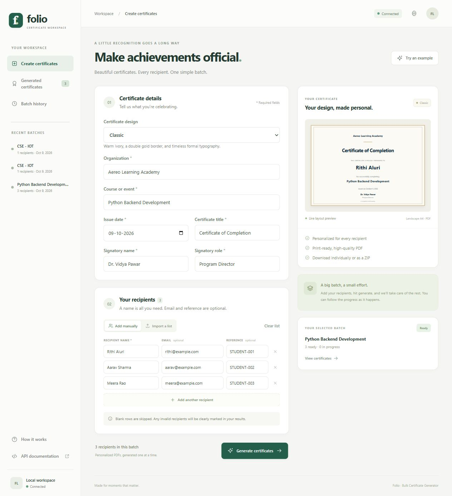
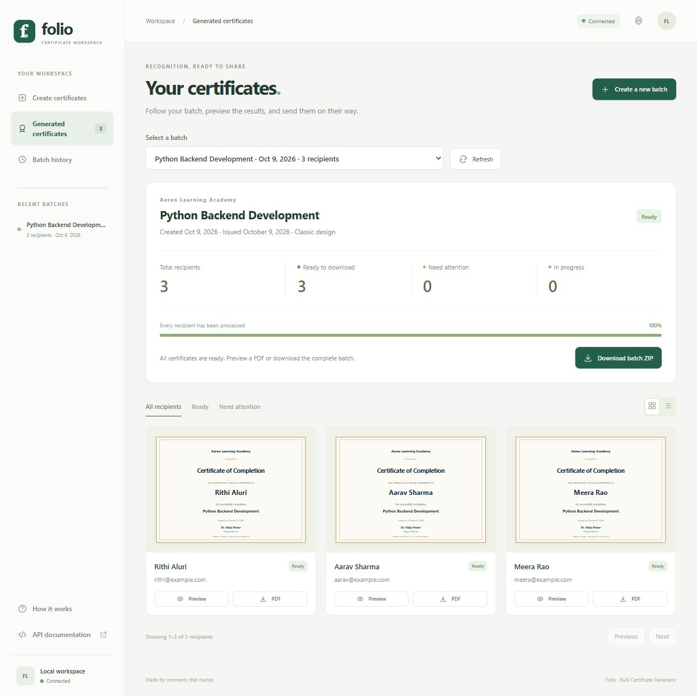
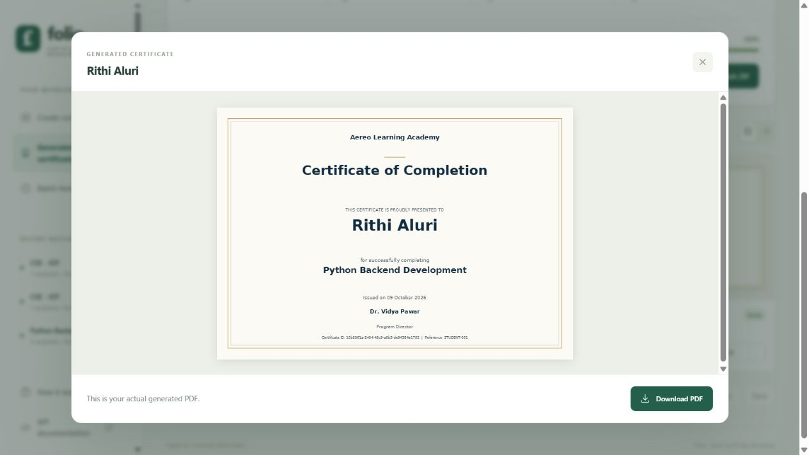
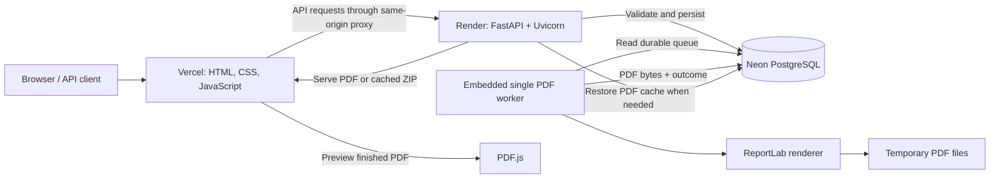
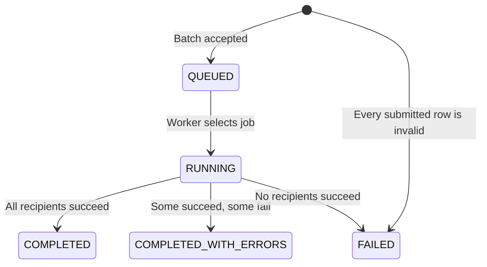
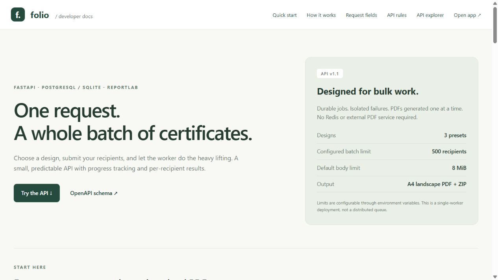

<p align="center">
  
</p>

<h1 align="center">Folio · Bulk Certificate Generator</h1>

<p align="center">
  Personalized certificates for courses, events, and training programs.<br />
  <strong>One batch request. Progress for every recipient. PDFs ready to share.</strong>
</p>

<p align="center">
  <a href="https://aereo-assignment-certificate-genera.vercel.app/"><strong>Open live application ↗</strong></a> ·
  <a href="https://folio-aereo-api.onrender.com">Backend ↗</a> ·
  <a href="https://aereo-assignment-certificate-genera.vercel.app/docs">Interactive API docs ↗</a> ·
  <a href="https://github.com/rithinreddy0/Aereo-Assignment-Certificate-Generator/actions/workflows/tests.yml">CI results ↗</a>
</p>

<p align="center">
  <a href="https://github.com/rithinreddy0/Aereo-Assignment-Certificate-Generator/actions/workflows/tests.yml"></a>
</p>

<p align="center">
  <a href="#try-it-in-two-minutes">Try it</a> ·
  <a href="#product-tour">Product tour</a> ·
  <a href="#architecture">Architecture</a> ·
  <a href="#how-a-batch-is-processed">Workflow</a> ·
  <a href="#technology-and-library-choices">Libraries</a> ·
  <a href="#run-locally">Run locally</a> ·
  <a href="#understand-and-extend-the-code">Extend the code</a>
</p>

## The problem and the solution

Creating certificates one at a time makes a simple task repetitive. A bulk workflow also needs
to show which recipients succeeded, what failed, and whether a retry will duplicate the batch.

Folio accepts shared certificate details and a recipient list, saves a durable job, and returns
`202 Accepted` with a job ID. A worker generates personalized PDFs while the browser tracks
progress. Invalid rows stay visible without preventing valid recipients from completing.

The frontend, public API, and PDF worker use the same stored job state. The deployed application
uses **Vercel + Render + Neon PostgreSQL**; local development uses **SQLite** by default.

## Try it in two minutes

1. Open the [live application](https://aereo-assignment-certificate-genera.vercel.app/).
2. Click **Try an example**, select Classic, Modern, or Minimal, and click **Generate certificates**.
3. Watch the batch reach completion and inspect the individual recipient results.
4. Open **Preview** to see the actual generated PDF. Download one PDF or the complete batch ZIP.
5. Open **Batch history** to revisit the job, or use the [API explorer](https://aereo-assignment-certificate-genera.vercel.app/docs) to submit a request directly.

The public demo needs no API key. Its batch limit is **500 recipients**; the local default is
10,000. Render's free backend sleeps when idle, so the first connection may take about a minute.
Use synthetic recipient data: visitors share the demo's history.

## Product tour

### Create a batch

Enter organization, course/event, date, title, and signatory details. Add recipients manually
or import CSV. The live layout preview updates as the fields change.



### Follow every outcome

The results screen shows completed, failed, and pending counts, progress, individual errors,
recipient filters, pagination, and grid/list views. Successful PDFs remain downloadable after
the backend restarts because the cloud database stores their contents.



### Preview the actual PDF

ReportLab produces the file; PDF.js displays it in the browser. The viewer shows the same PDF
that the download endpoint returns.



<p align="center">
  
  
  
</p>

<p align="center"><strong>Classic</strong> · Formal &amp; timeless &nbsp; | &nbsp; <strong>Modern</strong> · Navy &amp; teal &nbsp; | &nbsp; <strong>Minimal</strong> · Clean &amp; understated</p>

All three designs use landscape A4, embedded fonts, text wrapping, and a shared fitting pipeline.
These previews come from generated certificates. The workspace screenshots show the live deployment.

## Features

- **Bulk input:** shared fields plus multiple recipients in one JSON request; manual entry and CSV import.
- **Three certificate designs:** a selected preset applies to the entire batch; Classic is the default.
- **Two validation boundaries:** shared-field errors reject the request; individual errors affect only their row.
- **Clear progress:** job and recipient states, per-row errors, paginated history, and attention filters.
- **Durable generation:** persisted queue, restart recovery, stable UUID filenames, and atomic PDF writes.
- **Safe submission retries:** optional idempotency keys return the existing job for an identical request.
- **PDF delivery:** genuine browser previews, individual downloads, and a ZIP of successful certificates.
- **Cloud persistence:** PostgreSQL stores jobs, recipients, and PDF bytes; lost local caches restore on demand.
- **Optional access control:** `X-API-Key` for API clients and an HttpOnly browser-session cookie for downloads.
- **Developer tooling:** typed OpenAPI, interactive Swagger UI, automated API/PDF tests, linting, and CI.

## Architecture



**Frontend:** Vercel serves static assets. The build script generates proxy routes for `/api/*`,
`/health`, `/ui-config`, `/ui-session`, and `/openapi.json`. Browser requests and download cookies
stay on the Vercel origin.

**Backend:** Render runs one Uvicorn process. With `CERT_EMBEDDED_WORKER=true`, the FastAPI lifespan
starts a worker thread and requests its shutdown when the service stops. The queue itself is in
the database, so accepted work survives the process.

**Database and files:** `jobs` owns many `recipients`; the cloud-only `certificate_files` table
stores one PDF per successful recipient as `BYTEA`. Local PDF/ZIP files are caches in cloud mode.
Without `DATABASE_URL`, the same code uses SQLite and persistent local files.

**Coordination:** file locks coordinate workers and archive builders on one machine. A PostgreSQL
transaction advisory lock additionally serializes generation across overlapping cloud deployments.
This remains a single-worker design; adding replicas does not make generation parallel.

## How a batch is processed

1. **Receive:** the body-limit middleware enforces the configured byte limit; optional authentication runs before the endpoint.
2. **Validate the shared request:** Pydantic checks certificate fields, date, template, and the batch envelope. Invalid shared information returns `422`.
3. **Validate recipients individually:** the service normalizes each row, validates optional email, and rejects duplicate emails within that batch. Bad rows become `INVALID`.
4. **Save atomically:** one transaction inserts the job and recipient rows. A unique idempotency key plus a canonical request hash prevents duplicate retry submissions.
5. **Accept:** the API returns `202` immediately with the saved job ID. Accepted does not mean generation is finished.
6. **Claim and render:** the lock-owning worker marks one recipient `PROCESSING`, commits, and renders outside the row-update transaction.
7. **Record the result:** it stores PDF bytes in cloud mode and commits the outcome and counters together. A rendering failure becomes `FAILED` and does not stop the remaining rows.
8. **Finish:** when every row is resolved, the job becomes `COMPLETED`, `COMPLETED_WITH_ERRORS`, or `FAILED`.
9. **Retrieve:** clients poll status, page through outcomes, preview/download a PDF, or request the completed batch ZIP.



`pending = total - succeeded - failed`. `invalid` is a subset of `failed`, so it must not be
added again. Progress counts resolved outcomes: 100% can include failures.

On restart, interrupted `PROCESSING` rows return to `QUEUED`. A crash between rendering and
committing the outcome can regenerate the same UUID-named PDF. This is **at-least-once processing**;
submission idempotency and worker recovery solve different problems.

## Technology and library choices

The combination follows a straightforward pipeline:
**Uvicorn → FastAPI/Starlette → Pydantic → persistence → worker → ReportLab → PDF.js**.

### HTTP and validation

- **FastAPI:** routes, dependencies, response models, and OpenAPI generation — [main.py](app/main.py).
- **Uvicorn:** runs the ASGI application and accepts network requests.
- **Starlette:** HTTP responses, static assets, and file delivery underneath FastAPI.
- **Pydantic:** strict request/response models, string constraints, valid dates, and template IDs — [schemas.py](app/schemas.py).
- **email-validator:** validates/normalizes optional email addresses through `EmailStr`; it does not deliver email or verify mailbox ownership.

### Persistence and generation

- **Psycopg:** parameterized PostgreSQL access for Neon. The small adapter preserves the existing query interface — [postgres.py](app/postgres.py).
- **SQLite / `sqlite3`:** local relational storage included with Python; WAL, foreign keys, and short transactions support local polling — [db.py](app/db.py).
- **filelock:** coordinates a worker per data directory and prevents competing ZIP/cache writes. Cloud worker coordination also uses PostgreSQL advisory locks.
- **ReportLab:** draws vector PDFs, embeds packaged fonts, checks supported glyphs, wraps text, and writes files atomically — [renderer.py](app/renderer.py).
- **Python standard library:** `uuid` for identifiers, `json` for shared data, `hashlib` for retry hashes, `hmac` for browser credentials, `zipfile` for archives, and threading/context managers for worker lifecycle and transactions.

### Browser, tests, and builds

- **HTML, CSS, JavaScript:** responsive interface, CSV parsing, fetch requests, progress polling, and paginated results.
- **PDF.js:** renders completed PDF files in a browser canvas; it is not the PDF generation engine.
- **Swagger UI:** interactive documentation generated from the backend's OpenAPI schema.
- **pytest + HTTPX:** API, validation, queue, authentication, and integration checks.
- **pypdf:** verifies the contents and page count of actual generated PDFs.
- **Ruff / Prettier:** Python and frontend formatting/linting tools.
- **setuptools / pip / venv:** Python packaging, installation, and isolated environments.
- **Node.js / npm:** vendors browser assets and builds the static Vercel deployment. It is not needed to run the local Python app.
- **GitHub Actions:** Python 3.11/3.12 checks and a separate PostgreSQL 18 integration job.
- **Docker / Compose:** optional local deployment of the API and worker with a shared volume.

Direct dependencies are in [pyproject.toml](pyproject.toml) and [package.json](package.json).
[requirements.lock](requirements.lock) and [package-lock.json](package-lock.json) record the tested
dependency versions, including transitive packages. The [technical guide](docs/TECHNICAL_GUIDE.md)
explains each component in more depth.

## API quick start

- **Frontend:** [Vercel workspace](https://aereo-assignment-certificate-genera.vercel.app/).
- **Backend base URL:** `https://folio-aereo-api.onrender.com`.
- **Interactive documentation:** [Swagger UI](https://aereo-assignment-certificate-genera.vercel.app/docs).
- **Machine-readable contract:** [OpenAPI JSON](https://aereo-assignment-certificate-genera.vercel.app/openapi.json).

From the repository root, submit the included sample (use `curl.exe` on Windows):

```bash
curl -X POST https://folio-aereo-api.onrender.com/api/jobs \
  -H 'Content-Type: application/json' \
  -H 'Idempotency-Key: reviewer-demo-001' \
  --data-binary @examples/job.json
```

Use a fresh key for a new batch. Copy the returned `id`, then:

```bash
curl https://folio-aereo-api.onrender.com/api/jobs/JOB_ID
curl 'https://folio-aereo-api.onrender.com/api/jobs/JOB_ID/certificates?limit=100&offset=0'
# Download after pending is zero and succeeded is greater than zero:
curl -L https://folio-aereo-api.onrender.com/api/jobs/JOB_ID/download -o certificates.zip
```

Public endpoints:

- `GET /api/templates` — discover designs.
- `POST /api/jobs` — validate/save a batch and return `202`.
- `GET /api/jobs` — paginated batch history.
- `GET /api/jobs/{job_id}` — job counts, status, and progress.
- `GET /api/jobs/{job_id}/certificates` — paginated outcomes; filter by `status` or `attention=true`.
- `GET /api/certificates/{certificate_id}/preview` — display a completed PDF inline.
- `GET /api/certificates/{certificate_id}/download` — download that PDF.
- `GET /api/jobs/{job_id}/download` — ZIP of successful PDFs after the job finishes.
- `GET /health` — API/database connectivity probe; not a worker heartbeat.

Errors have a `detail` field: `401` invalid configured key, `404` unknown ID, `409` unavailable
download/idempotency conflict, `410` missing PDF, `413` oversized body, `422` invalid input,
and `503` ZIP-lock timeout. UUID syntax errors also return `422`.



See the [complete API reference](docs/API_REFERENCE.md) for every field, response, error,
authentication rule, and a PowerShell walkthrough that polls before downloading.

## Run locally

Requires Python 3.11+. SQLite is the default, so no cloud credentials are necessary.

<details open>
<summary><strong>Windows · PowerShell</strong></summary>

```powershell
python -m venv .venv
.\.venv\Scripts\python.exe -m pip install -e ".[dev]" -c requirements.lock
.\.venv\Scripts\python.exe -m uvicorn app.main:app --host 127.0.0.1 --port 8000
```

In a second terminal in the same directory:

```powershell
.\.venv\Scripts\python.exe -m app.worker
```

</details>

<details>
<summary><strong>Linux / macOS</strong></summary>

```bash
python3 -m venv .venv
source .venv/bin/activate
python -m pip install -e '.[dev]' -c requirements.lock
python -m uvicorn app.main:app --host 127.0.0.1 --port 8000
# In a second terminal, activate the virtual environment:
python -m app.worker
```

</details>

Open `http://127.0.0.1:8000/` and `/docs`. API and worker must share the same data directory
and environment settings. The app does not automatically load `.env` files; set environment
variables in your shell, host dashboard, or Compose configuration.

For a single-process local demo, set `CERT_EMBEDDED_WORKER=true` before starting Uvicorn and
use one Uvicorn worker. For one-time queue processing, run `python -m app.worker --once`.
Docker is optional: `docker compose up --build -d` starts both services with a shared volume.

### Cloud configuration

- **Vercel:** repository root, framework Other, checked-in `vercel.json`; `BACKEND_URL` is the HTTPS Render origin.
- **Render:** Free Python web service, one Uvicorn worker, `/health` probe, and `CERT_EMBEDDED_WORKER=true`.
- **Neon:** secret `DATABASE_URL` on Render with TLS enabled. Jobs and PDFs persist in PostgreSQL.
- **Limits:** `CERT_MAX_RECIPIENTS`, `CERT_MAX_BODY_BYTES`, and `CERT_POLL_SECONDS`; optional `CERT_API_KEY` enables restricted access.

The [deployment guide](docs/DEPLOYMENT.md) gives the exact build/start commands and environment
variables. [render.yaml](render.yaml) provides the backend blueprint; [build-frontend.mjs](scripts/build-frontend.mjs)
produces Vercel's static output and proxy routes. Database credentials are never frontend variables.

## Verification

On October 9, 2026, the local suite passed **51 tests**, with one PostgreSQL-only case skipped
locally. Hosted CI passed the Python checks and PostgreSQL integration test. The badge above
links to the current workflow status.

```powershell
.\.venv\Scripts\python.exe -m pytest
.\.venv\Scripts\python.exe -m ruff check .
.\.venv\Scripts\python.exe -m ruff format --check .
```

Coverage includes validation, duplicate emails, partial progress, isolated renderer failures,
real PDF contents, templates, ZIP retrieval, pagination, authentication, body limits, concurrent
idempotency, restart recovery, and worker locking. The PostgreSQL test deletes the local PDF
cache, restarts the app, and verifies restored PDF/ZIP contents.

The live deployment was also checked for example generation, PDF preview, PDF/ZIP downloads,
OpenAPI/docs, and identical saved PDFs after backend redeployment. Automated tests and a live
walkthrough provide different kinds of evidence; both are reproducible.

## Understand and extend the code

Follow one request through these files:

1. [schemas.py](app/schemas.py) — typed inputs, normalization, constraints, and outgoing models.
2. [service.py](app/service.py) — per-row validation, canonical hashes, persistence, and archive creation.
3. [worker.py](app/worker.py) — queue selection, recovery, rendering outcomes, and job completion.
4. [renderer.py](app/renderer.py) — fonts, text fitting, template drawing, and atomic output.
5. [db.py](app/db.py) / [postgres.py](app/postgres.py) — schema, transactions, locks, and PDF persistence/cache restoration.
6. [main.py](app/main.py) — HTTP routes, middleware, authentication, and embedded-worker lifecycle.
7. [app.js](app/static/app.js) — CSV input, fetch/polling, results, preview lifecycle, and native downloads.

### Design decisions worth explaining

- **Why return `202`?** Rendering an entire batch inside one request would tie generation to the HTTP connection. Persisting work first lets the client reconnect and track it later.
- **Why validate rows separately?** `JobCreate.recipients` deliberately accepts raw rows; `create_job` applies `Recipient` validation to each. A malformed row therefore does not reject the batch.
- **Why render outside the row-update transaction?** PDF work should not hold those database transactions open. The separate advisory-lock transaction coordinates cloud workers during a queue drain.
- **Why two database modes?** SQLite makes local setup simple. PostgreSQL makes cloud state independent of Render's temporary disk. The adapter keeps the service queries shared.
- **Why database-stored PDFs?** Small assignment PDFs can survive free-host restarts without a second storage service. Object storage and retention quotas would be better for a larger deployment.
- **Why preserve UUID paths?** Recovered work writes to the same recipient path, so retries do not invent additional certificate identities.
- **Why distinguish invalid and failed?** Bad input becomes `INVALID`; a valid row whose rendering fails becomes `FAILED`. Both count toward processed outcomes.

### Practical changes and where they belong

- **Add a fourth design:** extend `TemplateId` and the catalogue in `templates.py`, add its drawing branch in `renderer.py`, and extend `test_templates.py`. The browser loads options from `/api/templates`.
- **Add a recipient field:** update `Recipient` and response models, database schema/migration strategy, service persistence, renderer arguments if printed, frontend/CSV handling, and contract tests.
- **Adjust capacity:** change environment limits and measure with `scripts/benchmark.py`; more workers require a new claim/coordination design, not just a process-count change.
- **Change the layout:** edit `style.css` or the renderer's preset branch, then inspect desktop/mobile UI and normal/maximum-length PDF output.
- **Investigate a stuck job:** inspect `pending` and recipient states, worker logs, database connectivity, and lock ownership. `/health` alone does not establish worker liveness.

For a useful review demonstration, submit one valid and one invalid recipient, explain the
result counters, retry with the same idempotency key, and trace `Worker.run_once` to the renderer.
Then make a small template change and show its generated PDF plus the relevant tests. The
[technical guide](docs/TECHNICAL_GUIDE.md) includes a deeper code walkthrough and discussion questions.

## Scope and next steps

This is a complete submission/demo with one PDF worker. Authentication is a shared optional key,
not individual accounts or job ownership. Email is metadata, not an email-delivery feature.
Packaged fonts support accented Latin text; broader script support needs suitable fonts and shaping.
Per-request limits do not impose total storage quotas. Free hosting sleeps and has resource limits.

Possible extensions include organization accounts, ownership checks, rate/storage quotas,
retention cleanup, controlled retries/cancellation, worker monitoring, verification URLs/QR codes,
email delivery, object storage, and versioned schema migrations. Distributed processing would
also require changing the single-worker claim strategy.

## Documentation and project links

- [Technical guide](docs/TECHNICAL_GUIDE.md) — libraries, data model, processing internals, and tradeoffs.
- [API reference](docs/API_REFERENCE.md) — fields, responses, authentication, errors, and examples.
- [Deployment guide](docs/DEPLOYMENT.md) — reproduce Vercel, Render, and Neon deployment.
- [Submission sheet](docs/SUBMISSION.md) — live URLs and reviewer walkthrough.
- [Sample JSON](examples/job.json) / [CSV](examples/recipients.csv) — reproducible inputs.

Project maintained under [rithinreddy0](https://github.com/rithinreddy0). Source code, commit history,
tests, and deployment configuration are available in this repository for review.
