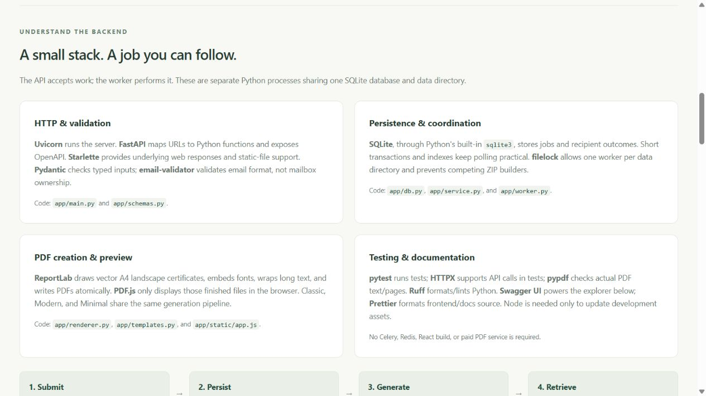

# Folio · Technical guide

Understand the application before changing it. This guide explains the tools, code structure,
database, processing flow, resource choices, and reliability boundaries.

[README](../README.md) · [Detailed API reference](API_REFERENCE.md)

## 1. What are we building?

Folio accepts a list of recipients and shared certificate details in **one request**. It creates
a persistent job, generates one PDF per valid recipient, tracks outcomes, and provides downloads.
The browser is an optional client: another application can use the same API directly.

A **job** is a batch. A **recipient** is one row in that batch. A **template** is a fixed visual
design. A **worker** is a separately running Python process that performs generation.

There are two processes to start:

- `python -m uvicorn app.main:app --port 8000`: listens for HTTP requests.
- `python -m app.worker`: polls SQLite and generates certificates.

This is asynchronous **job processing**, even though the PDF worker processes recipients
sequentially. It is not a distributed task queue and does not generate every PDF simultaneously.

## 2. Backend libraries: what each one does

The tested versions below come from [requirements.lock](../requirements.lock), not a claim about
the newest releases. [pyproject.toml](../pyproject.toml) declares compatible dependency ranges;
installing with `-c requirements.lock` applies the recorded constraints.

### FastAPI · 0.142.4

**Role:** the web framework. It connects URLs to Python functions, reads request bodies, runs
validation, handles dependencies, and describes the API through OpenAPI.

**Where:** [app/main.py](../app/main.py).

For example, `@app.post("/api/jobs")` connects an HTTP POST to `submit_job`. The `JobCreate`
parameter describes the accepted request. A `response_model` describes the JSON response.
`Depends(authenticate)` checks access before the endpoint runs.

Our routes mostly use ordinary `def` functions because SQLite and filesystem work are blocking.
Generation does not run inside an API request or through `BackgroundTasks`; it belongs to the
separate durable worker. An API request returns 202 once the job is accepted.

Reference: [FastAPI tutorial](https://fastapi.tiangolo.com/tutorial/).

### Uvicorn · 0.54.0

**Role:** the ASGI server that runs FastAPI and listens on a host/port.

FastAPI is the application; Uvicorn is the server accepting network requests for it.
`app.main:app` means “import the object named `app` from the module `app.main`.”
`--port 8000` selects the port. `--reload` restarts the API when Python code changes during
development; it does not restart the separate certificate worker.

### Starlette · 0.52.1

**Role:** the underlying web toolkit used by FastAPI for routing and HTTP responses.

FastAPI exposes its `FileResponse`, `JSONResponse`, and `StaticFiles` functionality here.
`FileResponse` returns PDF/ZIP files without our code reading the complete file into a Python
byte string. `StaticFiles` serves the HTML, CSS, JavaScript, and bundled viewer/docs assets.

### Pydantic · 2.13.5

**Role:** input/output models and validation.

**Where:** [app/schemas.py](../app/schemas.py) and [app/templates.py](../app/templates.py).

- `CertificateInfo`: validates common certificate fields and the preset ID.
- `Recipient`: validates one name, optional email, and optional reference.
- `JobCreate`: validates the overall submission.
- `JobView`, `JobPage`, `RecipientView`, `RecipientPage`: document outgoing JSON structures.

`strict=True` prevents loose conversion such as accepting a number as a recipient name.
`extra="forbid"` rejects unexpected fields. String constraints trim outer whitespace and
enforce lengths. Unicode normalization makes text representation more consistent.

An important choice: `JobCreate.recipients` is `list[Any]`, **on purpose**. Each item is passed to
`Recipient.model_validate` separately inside the service. If it were simply `list[Recipient]`,
the framework would reject an entire batch when one row was malformed. Here that row becomes
INVALID while valid rows still generate. Unsupported recipient font glyphs fail later during
rendering and become FAILED, not INVALID.

Reference: [Pydantic models](https://docs.pydantic.dev/latest/concepts/models/).

### email-validator · 2.3.0

**Role:** validation/normalization behind Pydantic's `EmailStr`.

Optional email values must have an acceptable address format. Folio does not send emails,
verify mailbox ownership, or promise that a mailbox exists. Duplicate validated email values
are checked case-insensitively within a batch by our own service code.
Omit email or use JSON `null` when unavailable; an empty string is not a valid address.

### ReportLab · 4.5.1

**Role:** actual PDF generation in Python.

**Where:** [app/renderer.py](../app/renderer.py).

The renderer creates an A4 landscape canvas, draws the selected background/borders, and prints
shared and recipient-specific text. It registers packaged Bitstream Vera fonts, checks glyph
coverage, wraps text, and reduces font size when needed. PDFs have embedded fonts and compressed
streams; text and borders are vector elements, not a screenshot of a browser page.

The three presets share one fitting/output pipeline:

- Classic: ivory background with a double gold border.
- Modern: navy masthead with teal accents.
- Minimal: white background with fine charcoal lines.

No Chromium, HTML-to-PDF service, external template download, or paid PDF API is used.
Accented Latin names are supported. Emoji and many other scripts are not supported by these
fonts; additional language support requires suitable fonts and shaping, not just a new color.

Reference: [ReportLab graphics and text](https://docs.reportlab.com/reportlab/userguide/ch2_graphics/).

### filelock · 3.32.7

**Role:** OS-backed coordination across separate processes.

One lock prevents two worker processes from owning the same data directory. Another guards
construction of a job ZIP so simultaneous first-download requests do not write it together.
This is not the same as a database transaction. Locks coordinate processes; transactions
coordinate database changes. Do not delete a lock file to bypass an active worker.

## 3. Database and standard Python tools

### SQLite through sqlite3

SQLite is a **relational database**, not an in-memory dictionary or a JSON file.
The Python `sqlite3` module is included with Python, so no separate database account/server is
required. [app/db.py](../app/db.py) creates and connects to `certificates.sqlite3`.

There are two tables:

- **jobs:** UUID, status, shared certificate JSON, counters, timestamps, optional unique
  idempotency key, and the request hash.
- **recipients:** UUID, owning job ID, original input position, validated metadata, status,
  and error text. The recipient UUID is also the certificate ID.

The relationship is one job to many recipient rows. Shared certificate details are stored once
per job instead of repeated for every recipient. PDFs live on disk, not as database BLOBs.

**Database settings:** WAL supports reads during writes; foreign keys require a real owning job;
full synchronous commits prioritize durability; a 30-second timeout waits for transient locks.
Indexes speed up queue selection, recipient filtering, and newest-first job history.
Each operation gets its own connection and uses short transactions with rollback on failure.

WAL does not make SQLite a distributed database or enable unlimited concurrent writers.
Use local persistent storage; do not deploy the database/file locks on a network or cloud-synced drive.

Reference: [Python sqlite3 documentation](https://docs.python.org/3/library/sqlite3.html).

### Other standard-library modules

- `uuid`: opaque UUIDs for jobs/recipients and stable output filenames.
- `pathlib`: database-owned paths and atomic replacement of temporary PDF/ZIP files.
- `json`: shared settings serialization and canonical request data.
- `hashlib`: SHA-256 payload fingerprints for idempotency checks.
- `hmac`: a separate signed browser-session credential and constant-time comparison.
- `zipfile`: builds a ZIP by iterating completed PDFs; ZIP_STORED avoids recompressing PDF streams.
- `datetime`: calendar issue dates and UTC timestamps.
- `unicodedata`: NFC normalization and rejection of control/invisible formatting characters.
- `functools.lru_cache`: a bounded cache of repeated text-fitting work.
- `dataclasses` and `os`: immutable settings read from environment variables.
- `contextlib`: connection/transaction and application-lifecycle management.
- `logging`: worker errors and completion events without exposing arbitrary server exceptions to clients.
- `argparse`: worker/sample/benchmark CLI options.
- `signal` and `threading.Event`: worker shutdown handling and interruptible idle waits.

These ship with Python; they are not additional paid services or separate pip requirements.

### Direct versus transitive dependencies

The lock file also records packages installed by the libraries above. For example, `pydantic-core`
is Pydantic's validation engine, AnyIO supports the web framework's async/thread coordination,
and `h11` provides HTTP protocol handling. Pillow is installed with ReportLab for image support,
but this renderer uses vector elements, not image backgrounds. These are not additional services
you need to start. The app imports the direct tools it needs; do not confuse every lock-file entry
with a separate architecture component.

## 4. Browser and documentation tools

### Plain HTML, CSS, and JavaScript

[app/static/](../app/static/) contains the UI. JavaScript uses `fetch` to call the same JSON API,
polls pending jobs, parses CSV into recipient objects, and displays paginated results.
CSS handles the responsive layout and illustrative live certificate previews.
There is no React/Next.js app, template editor, or separate frontend server.

### PDF.js · 6.4.299

**Role:** renders an already-generated PDF into a browser canvas when a preview opens.
It does **not** generate the certificates. It loads on demand, renders one page with capped
canvas density, and releases its loading task when the dialog closes.
Native PDF and ZIP downloads avoid buffering a full archive in JavaScript.

### Swagger UI · 5.33.1

**Role:** interactive API exploration inside `/docs`, based on `/openapi.json`.
“Try it out” sends a real request to the configured API—it is not a mock response.
The assets are checked into the repository and served locally. OpenAPI is the machine-readable
contract; the guide and Swagger UI are ways to read/test it.

### Prettier

**Role:** development-only formatting for HTML, CSS, JavaScript, and Markdown.
Node/npm are needed only to update/vendor browser assets or run formatting, not to run Folio.
[package.json](../package.json) declares these tools and `package-lock.json` records exact resolutions.

## 5. Testing and deployment tools

- **pytest:** executes tests with isolated temporary databases and reusable fixtures.
- **HTTPX:** supports FastAPI/Starlette's test client for simulated HTTP calls.
- **pypdf:** reads real generated PDFs in tests to verify page count/text. ReportLab creates them;
  pypdf verifies them. pypdf is a development dependency, not the generation engine.
- **Ruff:** Python linting and formatting.
- **setuptools/pip/venv:** package building, installation, and a project-specific Python environment.
- **Docker/Compose:** optional containers for one API and one worker with a shared data volume.
- **GitHub Actions:** the supplied workflow runs tests and quality checks on Python 3.11/3.12.

The current expanded suite has 50 tests. A configured workflow is not proof of a passing hosted
CI run; see your repository's Actions tab for that result.

## 6. Follow one request through the code

1. **HTTP intake:** the body-limit middleware rejects a request larger than the configured byte limit.
2. **Access check:** if a shared API key is configured, the dependency verifies it or the browser cookie.
3. **Envelope validation:** Pydantic validates `JobCreate` and `CertificateInfo`.
4. **Row validation:** `create_job` validates each recipient, checks duplicate emails, and records errors.
5. **Persistence:** one transaction inserts the job and all rows. An optional unique key and request hash
   distinguish an identical retry from a conflicting one.
6. **Acceptance:** the API returns the saved job. New valid work is QUEUED; an all-invalid batch is FAILED.
7. **Worker selection:** the lock-owning worker selects the oldest queued/running job and its next row.
8. **Claim:** it commits PROCESSING, then closes the transaction before PDF work.
9. **Render:** ReportLab writes a temporary PDF and atomically replaces the final UUID-named file.
10. **Outcome:** success/failure and the counter update commit together. One rendering failure is caught
    independently; the worker moves on to the next row.
11. **Completion:** the worker sets COMPLETED, COMPLETED_WITH_ERRORS, or FAILED from the final counters.
12. **Retrieval:** clients poll, page through results, and retrieve ready PDFs/ZIPs.

Because the middleware buffers a bounded body before routing, do not assume unauthorized uploads
are rejected before any body bytes are read. Add reverse-proxy limits for public deployments.

## 7. Reliability: what is and is not guaranteed

**Restart recovery:** the worker resets interrupted PROCESSING rows to QUEUED while owning its lock.
Completed recipients are skipped. Accepted jobs are durable; process-local tasks are not the queue.

**Stable paths:** a crash after writing a PDF but before committing success may cause that PDF to
be generated again at the same UUID path. This is at-least-once processing, not an exactly-once
transaction spanning SQLite and the filesystem.

**Failure boundaries:** validation rejects bad shared information before creating a job. Invalid
recipient rows stay visible. Unsupported recipient glyphs and render errors produce individual FAILED
rows. Storage/database outages still affect the system; failure isolation cannot make a full disk usable.

**Resource boundaries:** submission holds one bounded batch in memory; rendering handles one recipient
at a time; result pagination limits response size; archive creation iterates files on disk. Total
storage and queue size still grow with accepted work. Limits are per request, not global quotas.

**Security boundaries:** the shared key is optional and provides no individual accounts or job ownership.
Use HTTPS, admission/rate limits, persistent local storage, supervision, and backups before public exposure.
Docs/static pages are public even when API authentication is enabled.

## 8. How to explain it in an interview

“I built a FastAPI API with a durable SQLite queue and a separate single worker. Shared certificate
data is validated once; recipient data is validated individually so one bad row does not reject the
batch. ReportLab creates vector PDFs using a selected preset. The API returns 202 with a job ID,
and clients poll progress before retrieving PDFs or a ZIP. UUID paths and atomic writes support
restart recovery; idempotency keys protect submission retries. The design is appropriate for one
machine, with PostgreSQL/distributed workers a future architectural change—not a current feature.”

Useful questions to practice:

- Why return 202 instead of waiting for every PDF?
- Why is `invalid` included in `failed`?
- Why validate `list[Any]` recipients separately?
- What happens if the worker crashes between writing a PDF and updating SQLite?
- Why does adding more worker processes not increase capacity here?
- Why does email validation not mean a certificate is emailed?
- Why are PDF.js and ReportLab different responsibilities?
- Which limits would you add before making it public?

Start reading the code in this order: `schemas.py` → `service.py` → `worker.py` → `renderer.py`
→ `db.py` → `main.py`. Use [the API reference](API_REFERENCE.md) to test each behavior as you learn it.
